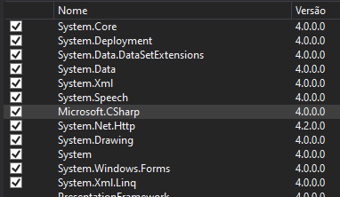
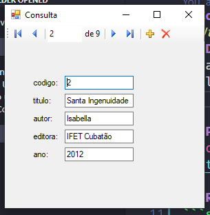

# Comando de Voz - C#
> Utilizando comando de voz e realizando ações.
## Descrição
_Desafio feito pelo **Prof. Maurício Neves Asenjo** com o objetivo realizar certas ações utilizando comando de voz._

## A aplicação realiza as seguintes funções:

 `fechar` - Fecha o formulário

 `primeiro` - Seleciona o botão para ir ao primeiro da lista.

 `ultimo` - Seleciona o botão para ir ao ultimo da lista.

 `proximo` - Seleciona o botão para ir proximo.

 `anterior` - Seleciona o botão para ir ao anterior.

Para realizar a utilização da aplicação é necessário realizar a instalação dos componentes abaixo.



## Prints do Projeto


## Requisito
```sh
* MicrosoftSpeechPlatformSDK
* MSSpeech_SR_pt-BR_TELE
* MSSpeech_TTS_pt-BR_Heloisa
* SpeechPlatformRuntime
* Visual Studio 201
```
## Autores
* **Leandro Bento Bergamo** - [lbbergamo](https://github.com/lbbergamo/)

```sh
Aplicação foi desenvolvida com Visual Studio 2019
```